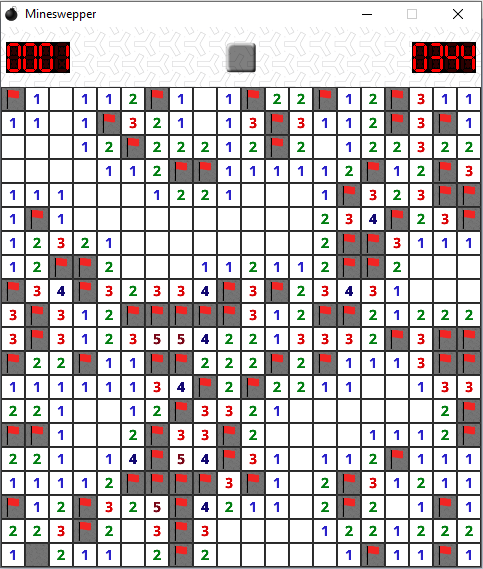

### SFML Mineswepper

#### About
Simple mineswepper game with fixed map size (this can be changed by changing map size by and compiling the project by yourself). 

#### Build
To build the project you will need:
- SFML >= 2.5
- Compiler with c++14 support

##### Steps
- git clone https://github.com/qqwertyui/mineswepper.git && cd mineswepper
- cmake .
- cmake --build .